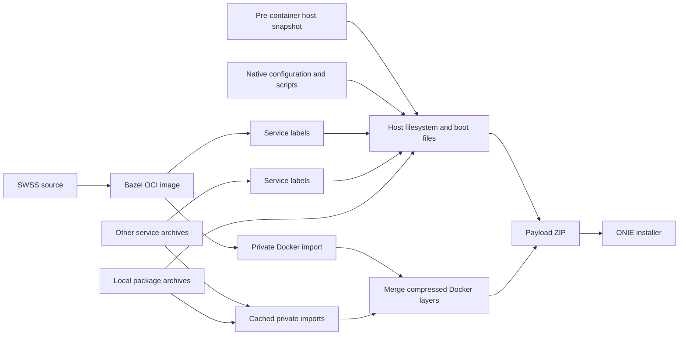

# Cacheable VS image assembly

`//tools/bazel/image/vs:sonic-vs.bin` builds the SWSS container from source and
assembles a bootable SONiC VS ONIE installer in one Bazel graph. This initial
configuration supports amd64, Debian Trixie, Docker 28.5.2 `overlay2`, and unsigned
ONIE images. The normal Make image build is unchanged.

The graph consumes explicit phase-one predecessors: a **pre-container host
snapshot**, native source/configuration needed to finalize that snapshot, and
the other service images. It does not rebuild every Debian package or use a
previously finished installer as its host input. A cold build of those retained
predecessors is outside this graph.



## Cache boundaries

* The host depends on every built-in service label and the declared service
  configuration. It does not depend on those services' executable bytes.
  `dhcp-relay` and `macsec` remain full host inputs because their package
  installers may contribute host plugins or configuration.
* Each service archive has an independent native Docker import action. The
  action uses a fresh private daemon, then packages its native layer data,
  tar-split metadata, image config, and tags. Cache IDs and lower-layer links
  are normalized using Docker ChainIDs.
* Store assembly deduplicates shared layers and concatenates existing gzip
  members. It does not decompress and recompress all unchanged services.
  Opaque overlay directories are converted to equivalent device whiteouts using
  a read-only kernel view of their parent layers. This preserves ordinary
  GNU/BusyBox tar extraction and Docker's original tar-split export contract.
  Other extended attributes currently fail closed instead of being silently
  lost by the installer.
* ZIP and ONIE packaging are separate actions. The ONIE wrapper is streamed
  directly to its output and retains the existing checksum and extraction
  contract.

A one-line SWSS binary change rebuilds SWSS, its OCI/archive outputs, its store
part, the store merge, ZIP, and wrapper. Its metadata projection runs again;
unchanged projection bytes allow reuse of the host. Other service imports stay
cached. An edited service still imports and compresses its own complete image;
individual layers discovered inside that import are not separate Bazel actions.

## Declared inputs and execution

The preparation scripts freeze native predecessors under
`target/bazel-image-inputs/` and write a generated `inputs.bzl` plus provenance
receipts. Large generated inputs are not committed.
Preparation also installs `vs/BUILD.bazel` from its checked-in template, so a
fresh checkout can load other Bazel packages before native inputs are available.
Changes to the frozen native source, generated services, or configuration
require preparing those inputs again. `build_debian.sh` and the extension
template are direct graph inputs and are always read from the current checkout.

1. Obtain a pre-container host snapshot with its
   `.sonic-bazel-host-state.json` identity and capture the matching native Make
   template environment and rendered service scripts. The capture must stop
   before running `build_debian.sh`; do not use a completed host filesystem.
2. Run `prepare_host_inputs.py --source NATIVE_SOURCE --captured-environment
   ENV.json --snapshot HOST.squashfs --output target/bazel-image-inputs`. It
   selects post-boundary source files, generated services, and required packages,
   excluding service archives, prior image outputs, Git data, and build caches.
3. Run `prepare_inputs.py --help` and supply that host bundle, the evaluated
   native inventory, a JSON mapping of archive basenames to local input paths,
   installer configuration/source, and execution environment. The SWSS archive
   mapping is always replaced by the source-built Bazel target. Installer
   preparation includes the existing platform configurations and all three VS
   KVM platforms.

The execution environment JSON declares `schema`, `platform`, `worker_image`
(an immutable Docker image ID), `docker_version`, `storage_driver`, and
`distribution`. Actions verify the worker marker; Docker actions also verify
the daemon version. The worker must contain Python 3.13, Docker 28.5.2, pigz,
GNU tar, squashfs-tools, `j2`, and the native SONiC image tools. The tested
worker is the pinned SONiC Trixie slave used by the preceding native build.

Run the target through `run.py` in a dedicated privileged worker. The worker
gets a bind mount of the explicitly selected source/build area and **no host
Docker socket**. Host and Docker actions additionally use private PID, mount,
and network namespaces. Their scratch stores are discarded after each action.
Do not run these privileged actions directly on a workstation or lab host.

These rules use the pinned worker's system tools and support local execution.
Remote execution is disabled; remote execution toolchains and a completely
source-built OS/package closure are follow-up work. Normal Bazel action caching
is enabled, including for the isolated privileged actions.

## Validation and limitations

```sh
bazel test //tools/bazel/image:metadata_test //tools/bazel/image:host_test \
  //tools/bazel/image:store_test //tools/bazel/image:installer_test
```

The tests cover metadata invalidation, snapshot identity, unsafe source bundles,
Docker ChainID/lower-link consistency, shared-layer deduplication, byte reuse,
archive readers, and the real ONIE shell wrapper's extraction/checksum behavior.
A live integration check must also restore the assembled store under the pinned
Docker version, run the rebuilt executable, and exercise Docker save/reload.
Image validation must inspect the final payload, rather than only its source
container.

Unsupported configurations fail closed: cross builds, other platforms,
Kubernetes/remote packages, organization hooks, debug host images, reduced-size
filesystem formats, SBOM generation, and secure signing. Do not compare this
warm-cache incremental path to a cold build of all SONiC sources.
