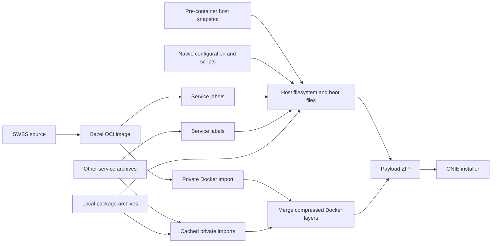

# Cacheable VS image assembly

`//tools/bazel/image/vs:sonic-vs.bin` builds the SWSS container from source and
assembles a bootable SONiC VS ONIE installer in one Bazel graph. This initial
configuration supports amd64, Debian Trixie, Docker 28.5.2 `overlay2`, and unsigned
ONIE images. The normal Make image build is unchanged.

See the [measured one-line SWSS benchmark](BENCHMARK.md) for timings, verified
cache behavior, artifact identity, and the reproduction method.

The graph consumes explicit phase-one predecessors: a **pre-container host
snapshot**, native source/configuration needed to finalize that snapshot, and
the other service images. It does not rebuild every Debian package or use a
previously finished installer as its host input. A cold build of those retained
predecessors is outside this graph.



## Cache boundaries

* The host depends on every built-in service label and the declared service
  configuration. It does not depend on those services' executable bytes.
  `dhcp-relay` and `macsec` remain full host inputs because their package
  installers may contribute host plugins or configuration.
* Each service archive has an independent native Docker import action. The
  action uses a fresh private daemon, then packages its native layer data,
  tar-split metadata, image config, and tags. Cache IDs and lower-layer links
  are normalized using Docker ChainIDs.
* Store assembly deduplicates shared layers and concatenates existing gzip
  members. It does not decompress and recompress all unchanged services.
  Opaque overlay directories are converted to equivalent device whiteouts using
  a read-only kernel view of their parent layers. This preserves ordinary
  GNU/BusyBox tar extraction and Docker's original tar-split export contract.
  Other extended attributes currently fail closed instead of being silently
  lost by the installer.
* ZIP and ONIE packaging are separate actions. The ONIE wrapper is streamed
  directly to its output and retains the existing checksum and extraction
  contract.

A one-line SWSS binary change rebuilds SWSS, its OCI/archive outputs, its store
part, the store merge, ZIP, and wrapper. Its metadata projection runs again;
unchanged projection bytes allow reuse of the host. Other service imports stay
cached. An edited service still imports and compresses its own complete image;
individual layers discovered inside that import are not separate Bazel actions.

## Declared inputs and execution

The preparation scripts freeze native predecessors under
`target/bazel-image-inputs/` and write a generated `inputs.bzl` plus provenance
receipts. Large generated inputs are not committed.
This checkout consumes a bundle from a separate phase-one native build provider;
it does not produce the snapshot state marker or evaluated native inventory.
An ordinary completed Make installer or unmarked SquashFS is not a substitute.
Preparation also installs `vs/BUILD.bazel` from its checked-in template, so a
fresh checkout can load other Bazel packages before native inputs are available.
Changes to the frozen native source, generated services, or configuration
require preparing those inputs again. `build_debian.sh` and the extension
template are direct graph inputs and are always read from the current checkout.

1. Obtain a pre-container host snapshot with its
   `.sonic-bazel-host-state.json` identity and capture the matching native Make
   template environment and rendered service scripts. The capture must stop
   before running `build_debian.sh`; do not use a completed host filesystem.
2. Run `prepare_host_inputs.py --source NATIVE_SOURCE --captured-environment
   ENV.json --snapshot HOST.squashfs --output target/bazel-image-inputs`. It
   selects post-boundary source files, generated services, and required packages,
   excluding service archives, prior image outputs, Git data, and build caches.
3. Run `prepare_inputs.py --help` and supply that host bundle, the evaluated
   native inventory, a JSON mapping of archive basenames to local input paths,
   installer configuration/source, and execution environment. The SWSS archive
   mapping is always replaced by the source-built Bazel target. Installer
   preparation includes the existing platform configurations and all three VS
   KVM platforms.

### Capturing the native template environment

The tested preparer path used a retained native provider's Make invocation and
a capture-only replacement for `build_debian.sh`. The following portable capture
pattern documents that boundary; it is not a validated recipe for a cold native
build. Work only in a disposable copy of the provider's matching native tree,
with its generated prerequisites and the same slave, configuration, Make
variables, and exported snapshot identity (`SONIC_BAZEL_SOURCE_COMMIT`,
`SONIC_BAZEL_SOURCE_BRANCH`, and `SOURCE_DATE_EPOCH`).

```sh
cp build_debian.sh build_debian.capture-source.sh
test ! -e captured-host-environment.json
cat > build_debian.sh <<'PY'
#!/usr/bin/env python3
import json, os, pathlib, re

sources = [pathlib.Path('build_debian.capture-source.sh'), pathlib.Path('slave.mk')]
sources += list(pathlib.Path('files/build_templates').rglob('*.j2'))
names = {'SONIC_BAZEL_SOURCE_COMMIT', 'SONIC_BAZEL_SOURCE_BRANCH', 'SOURCE_DATE_EPOCH'}
for source in sources:
    names.update(re.findall(r'[A-Za-z_][A-Za-z_0-9]*', source.read_text()))
ambient = {'PWD', 'HOME', 'USER', 'LOGNAME', 'PATH', 'SHELL', 'SHLVL',
           'MAKEFLAGS', 'MAKELEVEL', 'MFLAGS', 'DOCKER_HOST', 'RUSTUP_HOME'}
captured = {}
for name, value in os.environ.items():
    if name not in names or name in ambient:
        continue
    if any(word in name.upper() for word in ('PASSWORD', 'TOKEN', 'SECRET', 'PROXY')):
        if name != 'CHANGE_DEFAULT_PASSWORD' or value not in ('y', 'n'):
            continue
    captured[name] = value
os.umask(0o077)
with open('captured-host-environment.json', 'x') as output:
    json.dump(captured, output, indent=2, sort_keys=True)
    output.write('\n')
raise SystemExit(88)
PY
chmod 755 build_debian.sh
```

Now repeat the provider's native image Make command **inside its native slave**,
including its original variable assignments and Make overlays. For a provider
using only `slave.mk`, the target invocation is:

```sh
make -f slave.mk SONIC_BUILD_TARGET=target/sonic-vs.bin target/sonic-vs.bin
# Expected: build_debian.sh exits 88; Make reports a nonzero status.
mv build_debian.capture-source.sh build_debian.sh
test -s captured-host-environment.json
```

The capture stops before filesystem assembly; Make may still rebuild missing
prerequisites before reaching it. Restore the original script before preparing
the source bundle. Pass this local JSON file to `prepare_host_inputs.py`; do not
dump the entire shell environment or publish captured environment files. The
preparer validates supported options and identity, and the host action checks
that identity against the pre-container snapshot.

The execution environment JSON declares `schema`, `platform`, `worker_image`
(an immutable Docker image ID), `docker_version`, `storage_driver`, and
`distribution`. Actions verify the worker marker; Docker actions also verify
the daemon version. The worker must contain Python 3.13, Docker 28.5.2, pigz,
GNU tar, squashfs-tools, `j2`, and the native SONiC image tools. The tested
worker is the pinned SONiC Trixie slave used by the preceding native build.
`run.py` intentionally executes Bazel as UID/GID `1000:1000` in that worker.
The mounted source trees, output directory (or its parent when creating it), and
optional repository cache must be accessible and writable by those IDs. A host
account with another UID is not automatically mapped; use an appropriately
owned build area or a prepared worker setup before running this wrapper.

Run the target through `run.py` in a dedicated privileged worker. The worker
gets a bind mount of the explicitly selected source/build area and **no host
Docker socket**. Host and Docker actions additionally use private PID, mount,
and network namespaces. Their scratch stores are discarded after each action.
Do not run these privileged actions directly on a workstation or lab host.

These rules use the pinned worker's system tools and support local execution.
Remote execution is disabled; remote execution toolchains and a completely
source-built OS/package closure are follow-up work. Normal Bazel action caching
is enabled, including for the isolated privileged actions.

## Persistent developer loop

Pass `--persistent-worker NAME` to reuse the isolated worker and its Bazel server
across invocations. The launcher verifies the immutable worker image, declared
specification, bind mounts, resource limits and account identity before executing
inside the existing container. It serializes lifecycle/build operations with a
lock. The same server retains Bazel analysis state and a bounded 200,000-entry
file-digest cache. Cache checks and normal dependency invalidation remain enabled.
Without this option, the launcher retains its disposable worker and batch JVM.

Use the same absolute paths and startup flags on every invocation:

```sh
python3 tools/bazel/image/run.py \
  --workspace /absolute/build-area/sonic-buildimage \
  --mount-root /absolute/build-area \
  --worker-spec /absolute/build-area/sonic-buildimage/target/bazel-image-inputs/execution-environment.json \
  --output-user-root /absolute/build-area/bazel-state \
  --repository-cache /absolute/repository-cache \
  --persistent-worker sonic-vs-dev \
  -- build //tools/bazel/image/vs:sonic-vs.bin
```

If the pinned worker lacks `/usr/local/bin/bazel`, add `--bazel` with an absolute
executable path inside the mounted build area. Preserve any source overrides,
distdir, or Java trust-store startup flags required by the workspace. The launcher
uses the same 8-CPU quota, 24-GiB limit, eight jobs and CPU resource budget of eight
in persistent mode. `--worker-user` and `--worker-home` can preserve a prior
worker's UID-1000 account identity; both must match on later invocations.

With the same launcher configuration, `--worker-action start` creates/initializes
only the worker, `--worker-action status` reports its identity, and
`--worker-action stop` shuts down its Bazel server and removes that verified
worker. `run` is the default action and starts the worker if needed. The persistent
container remains available until explicitly stopped. A startup-option change
can make Bazel restart its server; changing source or build options still causes
normal incremental analysis and rebuilding.

The merged Docker archive, payload ZIP and ONIE installer finish with Bazel's
normal read-only output mode before their actions exit. This prevents a later
permission change from invalidating freshly computed file digests; it does not
change archive contents or bypass artifact hashing. ONIE tar streaming and
file copies use 1 MiB buffers to reduce small Python writes while preserving
headers, padding and checksums; a regression test compares the exact bytes with
the default-buffer implementation.

For an incremental benchmark, report worker/JVM startup and initial graph/cache
population separately. Require an unchanged zero-spawn invocation, then time a
fresh one-line source change through all build actions, final publication and
checksums. The latest measurement harness copies the installer and runtime
archive first, then hashes those two files and the three assembly outputs with
three read-only checksum workers. All five files are read independently in full;
this publication optimization is recorded separately from the Bazel launcher.
See [benchmark results](BENCHMARK.md) for both the original serial-publication
trial and this follow-up at the same output/checksum boundary.

## Validation and limitations

Pull requests, including drafts and stacked branches, run the
[Bazel workflow](../../../.github/workflows/bazel.yml) on native AMD64 in a
pinned Debian Trixie container. `Bazel checks (AMD64)` runs formatting, the image
assembly and worker tests, OCI conversion, SWSS configuration rendering, Make
readiness/fallback tests, and registry configuration checks. `Bazel SWSS packages
(AMD64)` builds the complete SWSS runtime, its dependency layer, rendered
configuration, and matching debug-symbol layer from the recorded component
sources. It checks the 30-program install contract, root ownership, ELF
architecture, build IDs, DWARF and debuglink checksums, and uploads packages and
build evidence.

The CI commands can also run from an initialized checkout in the same execution
environment:

```sh
python3 tools/bazel/ci/run.py test --artifacts artifacts/tests
python3 tools/bazel/ci/run.py build --artifacts artifacts/packages
```

Hosted CI does not have the native predecessor bundle required for the complete
OCI archives or VS installer. Full image assembly, Docker runtime and guest boot
validation remain the separately documented integration checks; CI does not
replace them with synthetic predecessor files. The imported DASH library's
missing debug symbols remain an explicit package-validation exception.

```sh
bazel test //tools/bazel/image:metadata_test //tools/bazel/image:host_test \
  //tools/bazel/image:store_test //tools/bazel/image:installer_test \
  //tools/bazel/image:run_test
```

The tests cover metadata invalidation, snapshot identity, unsafe source bundles,
Docker ChainID/lower-link consistency, shared-layer deduplication, byte reuse,
archive readers, persistent-worker identity/lifecycle/locking, and the real ONIE shell wrapper's extraction/checksum behavior.
A live integration check must also restore the assembled store under the pinned
Docker version, run the rebuilt executable, and exercise Docker save/reload.
Image validation must inspect the final payload, rather than only its source
container.

Unsupported configurations fail closed: cross builds, other platforms,
Kubernetes/remote packages, organization hooks, debug host images, reduced-size
filesystem formats, SBOM generation, and secure signing. Do not compare this
warm-cache incremental path to a cold build of all SONiC sources.
