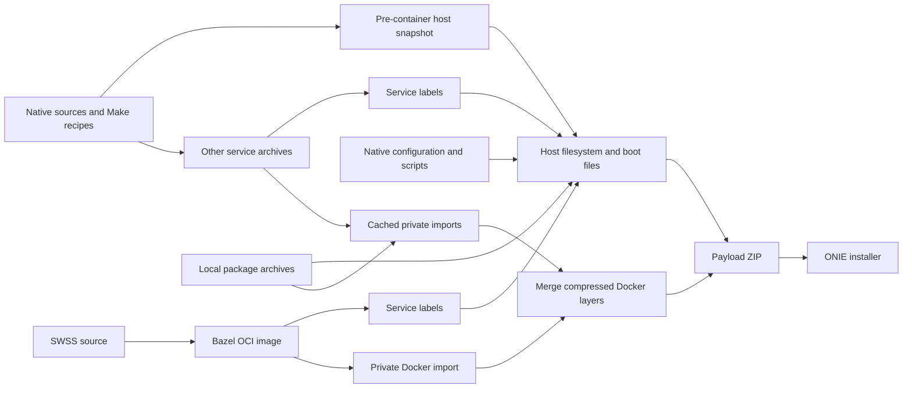

# Cacheable VS image assembly

`//tools/bazel/image/vs:sonic-vs.bin` builds the SWSS container from source and
assembles a bootable SONiC VS ONIE installer in one Bazel graph. This initial
configuration supports amd64, Debian Trixie, Docker 28.5.2 `overlay2`, and unsigned
ONIE images. The normal Make image build is unchanged.

See the [measured one-line SWSS benchmark](BENCHMARK.md) for timings, verified
cache behavior, artifact identity, and the reproduction method.

The graph consumes explicit phase-one predecessors: a **pre-container host
snapshot**, native source/configuration needed to finalize that snapshot, and
the other service images. It does not rebuild every Debian package or use a
previously finished installer as its host input. The source-image CI job builds
these predecessors with the native Make recipes in the same invocation, then runs
this Bazel graph. A warm developer build can reuse previously generated inputs.



## Cache boundaries

* The host depends on every built-in service label and the declared service
  configuration. It does not depend on those services' executable bytes.
  `dhcp-relay` and `macsec` remain full host inputs because their package
  installers may contribute host plugins or configuration.
* Each service archive has an independent native Docker import action. The
  action uses a fresh private daemon, then packages its native layer data,
  tar-split metadata, image config, and tags. Cache IDs and lower-layer links
  are normalized using Docker ChainIDs.
* Store assembly deduplicates shared layers and concatenates existing gzip
  members. It does not decompress and recompress all unchanged services.
  Opaque overlay directories are converted to equivalent device whiteouts using
  a read-only kernel view of their parent layers. This preserves ordinary
  GNU/BusyBox tar extraction and Docker's original tar-split export contract.
  Other extended attributes currently fail closed instead of being silently
  lost by the installer.
* ZIP and ONIE packaging are separate actions. The ONIE wrapper is streamed
  directly to its output and retains the existing checksum and extraction
  contract.

A one-line SWSS binary change rebuilds SWSS, its OCI/archive outputs, its store
part, the store merge, ZIP, and wrapper. Its metadata projection runs again;
unchanged projection bytes allow reuse of the host. Other service imports stay
cached. An edited service still imports and compresses its own complete image;
individual layers discovered inside that import are not separate Bazel actions.

## Declared inputs and execution

The preparation scripts freeze native predecessors under
`target/bazel-image-inputs/` and write a generated `inputs.bzl` plus provenance
receipts. Large generated inputs are not committed.
The `bazel-vs-native-inputs` Make target produces the marked pre-container
snapshot, evaluated image inventory, captured configuration and source provenance
from the current recursive checkout. An ordinary completed Make installer or
unmarked SquashFS is not a substitute.
Preparation also installs `vs/BUILD.bazel` from its checked-in template, so a
fresh checkout can load other Bazel packages before native inputs are available.
Changes to the frozen native source, generated services, or configuration
require preparing those inputs again. `build_debian.sh` and the extension
template are direct graph inputs and are always read from the current checkout.

The CI controller performs the native source build, checks its provenance, then
invokes `prepare_inputs.py` to declare the generated host bundle, service archives,
installer sources and execution environment. The SWSS archive mapping always
selects its source-built Bazel target. Installer preparation includes the existing
platform configurations and all three VS KVM platforms.

### Building native prerequisites from source

Image CI starts with a fresh clone and initializes every recorded recursive
submodule. Before Make runs, it creates an independent Bazel checkout from the
same recorded Git objects, including every recursive gitlink. Working-tree
files, generated files and ignored local overrides are not copied. It builds
the [execution worker](worker/README.md) from the original checkout,
then runs the native preparation target in a separate worker with its own Docker
daemon. No host Docker socket or prepared SONiC release bundle is supplied.

The native stage runs `make -f Makefile.work BLDENV=trixie configure PLATFORM=vs
PLATFORM_ARCH=amd64`, followed by `bazel-vs-native-inputs` with the same fixed
build identity. Native package/image caches and slave-image registry pulls are
disabled for this initial source-build CI path. It compiles the kernel and native
prerequisites using Docker Hub for public base images and Debian's public package
mirrors, retaining the native recipes' recorded Debian image digests. For Monit
and rasdaemon, CI uses SHA256-pinned Debian source archives for the configured
versions and applies the existing SONiC patches before compiling their packages.
These archives are authenticated Debian releases; equivalence to the original
Salsa Git trees has not been verified. Ordinary Make builds retain the Git source
method.

For P4 PI 0.1.3-2, CI selects `P4LANG_PI_SOURCE_METHOD=github`. The source
stager uses SHA256-pinned archives for the upstream PI commit, its five recorded
submodules and the official `p4lang/packages` packaging commit, then applies the
existing SONiC patches. This establishes the source and packaging revisions;
byte-for-byte equivalence with the Open Build Service source tarball is not
asserted. Ordinary Make builds retain `P4LANG_PI_SOURCE_METHOD=obs`. BMV2 and
P4C keep their existing source-package recipes. P4C's original-archive checksum
must match the configured 1.2.4.2-3 descriptor; the older cached archive cannot
substitute for it. A source mirror missing the matching archive still requires
access to the upstream source repository.

The native stage also builds config-engine and the Scapy wheel. The Make target
excludes the orchagent archive while retaining its service templates; Bazel
builds that archive later. Other native service recipes still compile a native
SWSS DEB where their existing dependency graph requires one. Sysmgr remains on
its existing native path in this scoped image job.

The producer stops the host build immediately before service-container loading,
writes the snapshot identity, captures only the required non-secret template
environment, and records all recursive source revisions and output SHA256s in
`target/bazel-native/provenance.json`. The controller checks those against the
original clean revisions and the current invocation before declaring the Bazel
inputs. FRR's native recipe creates a Git commit for each declared SONiC patch
and a final changelog commit. The producer reconstructs each patch tree from the
recorded FRR gitlink, verifies the linear commit chain and changelog version,
and records the resulting native revision and input hashes separately in
`native_transformations`. Other submodule HEAD changes are rejected; the
recorded source revision map remains unchanged. Native Make can rewrite tracked
files such as SWSS's `Cargo.lock` and leave generated headers behind. The
controller records those mutations without
cleaning the native checkout, then verifies that the separate Bazel checkout
still contains exactly the recorded sources and no untracked or ignored files.
Only the verified native image inputs, config-engine archive and Scapy wheel
are staged for Bazel. Installer preparation, SWSS compilation and image assembly
use the pristine checkout; `bazel-source-receipt.json`,
`native-source-audit.json` and `input-receipt.json` record this boundary.

The underlying recipes still use normal Debian packages, base images and
execution tool downloads. SWSS and DASH use the recorded source gitlinks in the
Bazel graph. This CI change covers the SWSS Docker image and
VS assembly; it does not migrate every component's build system to Bazel.

The execution environment JSON declares `schema`, `platform`, `worker_image`
(an immutable Docker image ID), `docker_version`, `storage_driver`, and
`distribution`. Actions verify the worker marker; Docker actions also verify
the daemon version. The worker must contain Python 3.13, Docker 28.5.2, pigz,
GNU tar, squashfs-tools, `j2`, and the native SONiC image tools. Image CI builds
the checked-in worker recipe; the native Make stage builds its own Trixie slave
inside that worker's private Docker daemon.
`run.py` intentionally executes Bazel as UID/GID `1000:1000` in that worker.
The mounted source trees, output directory (or its parent when creating it), and
optional repository cache must be accessible and writable by those IDs. A host
account with another UID is not automatically mapped; use an appropriately
owned build area or a prepared worker setup before running this wrapper.

Run the target through `run.py` in a dedicated privileged worker. The worker
gets a bind mount of the explicitly selected source/build area and **no host
Docker socket**. Host and Docker actions additionally use private PID, mount,
and network namespaces. Their scratch stores are discarded after each action.
Do not run these privileged actions directly on a workstation or lab host.

These rules use the pinned worker's system tools and support local execution.
Remote execution is disabled; remote execution toolchains and a completely
source-built OS/package closure are follow-up work. Normal Bazel action caching
is enabled, including for the isolated privileged actions.

## Persistent developer loop

Pass `--persistent-worker NAME` to reuse the isolated worker and its Bazel server
across invocations. The launcher verifies the immutable worker image, declared
specification, bind mounts, resource limits and account identity before executing
inside the existing container. It serializes lifecycle/build operations with a
lock. The same server retains Bazel analysis state and a bounded 200,000-entry
file-digest cache. Cache checks and normal dependency invalidation remain enabled.
Without this option, the launcher retains its disposable worker and batch JVM.

Use the same absolute paths and startup flags on every invocation:

```sh
python3 tools/bazel/image/run.py \
  --workspace /absolute/build-area/sonic-buildimage \
  --mount-root /absolute/build-area \
  --worker-spec /absolute/build-area/sonic-buildimage/target/bazel-image-inputs/execution-environment.json \
  --output-user-root /absolute/build-area/bazel-state \
  --repository-cache /absolute/repository-cache \
  --persistent-worker sonic-vs-dev \
  -- build //tools/bazel/image/vs:sonic-vs.bin
```

If the pinned worker lacks `/usr/local/bin/bazel`, add `--bazel` with an absolute
executable path inside the mounted build area. Preserve any source overrides,
distdir, or Java trust-store startup flags required by the workspace. The launcher
uses the same 8-CPU quota, 24-GiB limit, eight jobs and CPU resource budget of eight
in persistent mode. `--worker-user` and `--worker-home` can preserve a prior
worker's UID-1000 account identity; both must match on later invocations.

With the same launcher configuration, `--worker-action start` creates/initializes
only the worker, `--worker-action status` reports its identity, and
`--worker-action stop` shuts down its Bazel server and removes that verified
worker. `run` is the default action and starts the worker if needed. The persistent
container remains available until explicitly stopped. A startup-option change
can make Bazel restart its server; changing source or build options still causes
normal incremental analysis and rebuilding.

The merged Docker archive, payload ZIP and ONIE installer finish with Bazel's
normal read-only output mode before their actions exit. This prevents a later
permission change from invalidating freshly computed file digests; it does not
change archive contents or bypass artifact hashing. ONIE tar streaming and
file copies use 1 MiB buffers to reduce small Python writes while preserving
headers, padding and checksums; a regression test compares the exact bytes with
the default-buffer implementation.

For an incremental benchmark, report worker/JVM startup and initial graph/cache
population separately. Require an unchanged zero-spawn invocation, then time a
fresh one-line source change through all build actions, final publication and
checksums. The latest measurement harness copies the installer and runtime
archive first, then hashes those two files and the three assembly outputs with
three read-only checksum workers. All five files are read independently in full;
this publication optimization is recorded separately from the Bazel launcher.
See [benchmark results](BENCHMARK.md) for both the original serial-publication
trial and this follow-up at the same output/checksum boundary.

## Validation and limitations

Pull requests, including drafts and stacked branches, run the
[Bazel workflow](../../../.github/workflows/bazel.yml) on native AMD64 in a
pinned Debian Trixie container. `Bazel checks (AMD64)` runs formatting, the image
assembly and worker tests, OCI conversion, SWSS configuration rendering, Make
readiness/fallback tests, and registry configuration checks. `Bazel SWSS packages
(AMD64)` builds the complete SWSS runtime, its dependency layer, rendered
configuration, and matching debug-symbol layer from the recorded component
sources. It checks the 30-program install contract, root ownership, ELF
architecture, build IDs, DWARF and debuglink checksums, and uploads packages and
build evidence.

Hosted jobs install `zstd` before setup-bazel so cache archives use multithreaded
`zstdmt`. Compression is part of the cache version, so the first run safely misses
older gzip caches and populates Zstandard caches for later runs.

The CI commands can also run from an initialized checkout in the same execution
environment:

```sh
python3 tools/bazel/ci/run.py test --artifacts artifacts/tests
python3 tools/bazel/ci/run.py build --artifacts artifacts/packages
```

`Bazel VS installer (AMD64)` builds native prerequisites from the checked-out
sources, then builds `//tools/bazel/image/vs:sonic-vs.bin` with Bazel. It uses a
disposable self-hosted runner labeled `sonic-vs-source`, because a complete native
source build needs substantially more disk than standard hosted runners. The
job requires 300 GiB free after restoring caches. Provision Docker, Git, Python
3 and passwordless sudo on the runner; 32 GiB RAM is recommended. Native
preparation uses one package job, two compiler jobs per package and a 16-GiB
worker limit. The later Bazel worker uses four CPUs, 12 GiB and four jobs.

The worker is built from the checked-in public recipe. The controller refuses
retained target outputs, modified source trees, missing recursive submodules,
source revisions that differ from their gitlinks, and native receipts from a
different invocation. It records both the buildimage commit and every native
component revision. There are no prepared SONiC input release assets.

The job resolves the installer and intermediate outputs from that invocation's
Bazel event log, checks the ONIE checksum, and streams the complete payload ZIP
and Docker-store archive to verify CRCs and byte identity with the declared
SquashFS, store, boot and platform outputs. `sonic-vs.bin`, the matching SWSS
archive, checksums, input/build/validation receipts, logs and profiles are uploaded
as `sonic-vs-bazel-amd64` and retained for 14 days. Missing inputs or failed
validation fail the job. This is offline validation; live Docker execution,
SquashFS decoding, guest boot and forwarding require separate integration tests.

Repository downloads and Bazel source-package actions may be cached. The job
keeps full image outputs out of the action cache, hardlinks verified artifacts
into the upload directory on the same filesystem, and removes only successful
Bazel invocation scratch after worker shutdown. Failed runs retain scratch for
diagnosis. Native source-build scratch is confined to the disposable build area;
it is never published as a reusable input bundle.

Privileged image builds must run on disposable machines appropriate for the
reviewed code being executed. A private Docker daemon separates build state; it
is not a security boundary for untrusted PR code. Register ephemeral CI runners
according to the repository's external-contributor approval policy.

For a local reproduction, use a fresh standalone clone in a dedicated build
directory, initialize its recursive submodules, and run:

```sh
git submodule update --init --recursive --jobs 4
sudo python3 tools/bazel/ci/image.py \
  --workspace "$PWD" --state "$PWD/../vs-ci-state" \
  --artifacts "$PWD/artifacts/image"
```

On networks requiring an additional certificate issuer, append
`--ca-bundle /absolute/path/to/issuer-certificates.pem`. The controller validates
certificate-only PEM, records its SHA256 and certificate count, and builds it
into the execution worker's system and Bazel Java trust stores. The native
slave receives the combined trust bundle only in its generated build context;
its Dockerfile includes the bundle digest so a trust change invalidates that
worker image. Certificate bytes are excluded from published evidence and the
SONiC host/service inputs. Without this option, workers use their packaged trust
stores. The launcher does not mount the host's certificate directories.

The controller owns its dedicated workers and restores checkout ownership
afterward. It does not remove local SDKs or operate on unrelated Docker workers.
The source-built DASH library and Python extension require matching debug
symbols in package validation.

```sh
bazel test //tools/bazel/image:metadata_test //tools/bazel/image:host_test \
  //tools/bazel/image:store_test //tools/bazel/image:installer_test \
  //tools/bazel/image:run_test
```

The tests cover metadata invalidation, snapshot identity, unsafe source bundles,
Docker ChainID/lower-link consistency, shared-layer deduplication, byte reuse,
archive readers, persistent-worker identity/lifecycle/locking, and the real ONIE shell wrapper's extraction/checksum behavior.
A live integration check must also restore the assembled store under the pinned
Docker version, run the rebuilt executable, and exercise Docker save/reload.
Image validation must inspect the final payload, rather than only its source
container.

Unsupported configurations fail closed: cross builds, other platforms,
Kubernetes/remote packages, organization hooks, debug host images, reduced-size
filesystem formats, SBOM generation, and secure signing. Do not compare this
warm-cache incremental path to a cold build of all SONiC sources.
